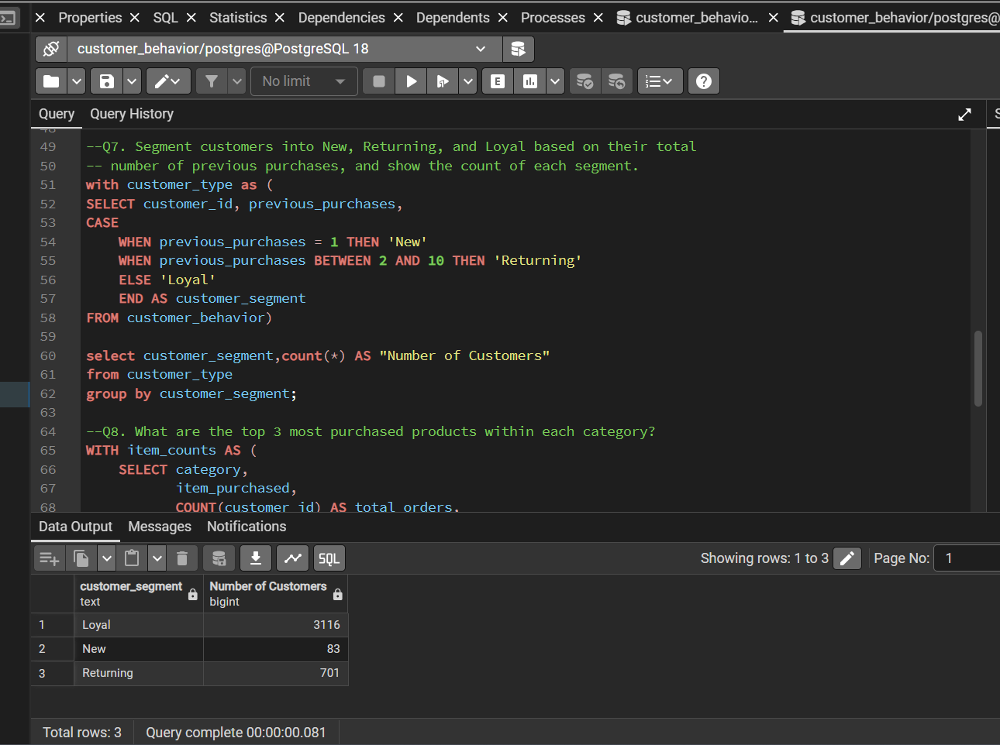

# ZEE’S SHOP CUSTOMERS PURCHASING HABITS AND BEHAVIOUR
Analysis of Customers Purchase Behaviour from Zee's Mart Dataset.

 
## Introduction

This project analyzes transactional data from **ZEE’s Shop** to uncover customers purchasing habits and behaviors.
Aim to uncover actionable insights that could optimize sales strategies, improve marketing campaigns and enhance customer retention efforts.

By understanding patterns such as;
- purchase frequency
- Average order value
- product preferences

## Goal of Analysis

1.	To analyze overall customer and product dataset and identify high-performing products and customer segments.
2.	To derive data backed insights that could help stakeholders to improve customer experience, sales strategies, Project strategies and marketing efforts.
 
 
## Problem Statement 🤔

The stakeholders of ZEE’s shop wanted to move away from "mass marketing" and towards "targeted marketing."  They want to better understand its customers’ shopping
behavior in order to improve sales, customer satisfaction, and long-term loyalty. The management team has also noticed changes in purchasing patterns across demographics,
product categories, and sales channels (online vs. offline). They are particularly interested in uncovering which factors, such as discounts, reviews, seasons, or payment preferences,
drive consumer decisions and repeat purchases. 

**_The Challenge_**:🤔 The marketing team struggled to distinguish between high-value loyalists and one-time shoppers. They needed a data-driven approach to segment their audience and optimize ad spend. 
“How can the company leverage consumer shopping data to identify trends, improve customer engagement, and optimize marketing and product strategies?”

📂 **Dataset Description**
The dataset used in this analysis contains transactional data from an online retail store. It includes customer information, product details, and purchase history. 
Rows: 3,900, Columns: 18  (Available upon request)

**Key Features:**
- Customer demographics (Age, Gender, Location, Subscription Status)
- Purchase details (Item Purchased, Category, Purchase Amount, Season, Size, Color)
- Shopping behavior (Discount Applied, Promo Code Used, Previous Purchases, Frequency of Purchases, Review Rating, Shipping Type)
- Missing Data: 37 values in Review Rating column

##  ⚙️ Tools/ Skill and Methodologies demonstrated 

The following tools and technologies were used to perform this analysis:
1.	**Excel**: - To preview and do basic cleaning
2.	**Python**: Data Preparation and Advance cleaning.
- Pandas: For data manipulation and cleaning. 
 -	Exploratory Data Analysis (EDA)
 -	Missing Data Handling
 -	Column Standardization
 - Data Consistency Check
 -	 Database Integration
- NumPy: For numerical operations.
- Jupyter Notebooks: Used for interactive analysis and visualizations.

3.	**SQL**:  PostgreSQL
 -	For querying data stored in relational databases.
 -	performed structured analysis in PostgreSQL to answer key business questions

4.	POWER BI 📊
-	Build interactive dashboard in Power BI to present insights visually
-	Made use of measure, slicer, Filters, 
  
 
## Visualization 📊

**GENDER BASED VISUALIZATION**
You can interact with report [here](https://surl.li/wnoalg)

 FEMALE         |     MALE
:---------------:|:-------------------------:
        | 

 SUBSCIBERS         |     UNSUSCRIBERS
:---------------:|:-------------------------:
        | 
 

  SQL INTERFACE         |     PYTHON, JUPYTER NOTEBOOK
:----------------------:|:-------------------------:
            | 

## Analysis Key Insights 📈📉
 
🔑 Some Key Findings

1. **Gender Analysis:**
   - Male customers currently contribute more than double the revenue of female customers.
   - This indicates a significant imbalance in spending behaviour, which may point to:
   - higher average transaction values among male customers,
   - a larger male customer base,
   - more effective targeting of products appealing to men.

2. **SELLING PRODUCTS:**
   - Gloves lead as the top seller, closely followed by sandals and boots, indicating strong demand for seasonal accessories and footwear.

3. **SHIPPING OPTIONS**
  - Express shipping customers spend slightly more on average ($60.48) compared to Standard shipping customers ($58.46), indicating that customers willing to pay for faster delivery tend to make slightly larger purchases.

4. **SUBSCRIPTIONS**
  - Non-subscribers have a slightly higher average purchase amount ($59.87) compared to subscribers ($59.49), though the difference is minimal.
  - However, non-subscribers generate substantially higher total revenue due to a much larger customer base.

5. **CUSTOMER RTENTION**
  - Loyal customers (3,116) form the largest group, representing repeat business and long-term retention.
  - New customers are significantly fewer (83), but they represent first-time buyers who can be nurtured into loyal customers.
  -Returning customers (701) show an opportunity for growth—these customers have made a few purchases, and with proper engagement, could be converted into loyal, repeat buyers.

6. **AGE GROUP DEMOGRAPHY**
  - Young Adults generate the highest revenue ($62,143), indicating strong purchasing power or larger spending behavior in this segment.
  - The revenue is relatively even across age groups, with only a small gap between Middle Aged, Adult, and Senior groups.

## Recomendations
1. **Gender:**
  - This gap suggests a potential revenue uplift opportunity if female customer engagement is strengthened.

2. **PRODUCTS**
  - Leverage seasonal promotions around gloves, sandals, and boots to drive further sales, and explore bundling these products with complementary items like jackets and bags to boost revenue.

3. **SHIPPING**
 - Encourage more Express shipping:
 - Highlight the benefits of faster delivery through targeted marketing 
 - 	Consider offering small incentives, like free shipping upgrades for orders above a certain threshold, to increase express shipping adoption.

5. **SUBSCRIPTIONS**
 - Increase subscriber conversion
 - Develop targeted campaigns to encourage non-subscribers to sign up, highlighting exclusive offers or rewards for subscribers.
 - Introduce personalized offers for subscribers to boost their average spend, aiming to close the revenue gap between the two groups.

6. **CUSTOMER RETENTION**
 - Focus on Retention Strategies for New & Returning Customers:
 - Use targeted campaigns to turn new customers into returning ones by offering personalized discounts or rewards for their second purchase.
 - For returning customers, incentivize them with loyalty programs or exclusive offers to convert them into loyal buyers.
 -	Leverage Loyal Customers for Referrals by encouraging loyal customers to refer new customers by offering rewards, which will help in growing the new customer base.

7. **AGE GROUPS**
 - Continue to tailor promotions or product offerings to young adults, especially focusing on trendy or high-demand items for this age group.
 -	Develop targeted campaigns for Middle Aged, Adult, and Senior segments, focusing on products or services that resonate with their lifestyle or needs (e.g., health, comfort, value-based offerings).

 THANK YOU FOR READING🙏

