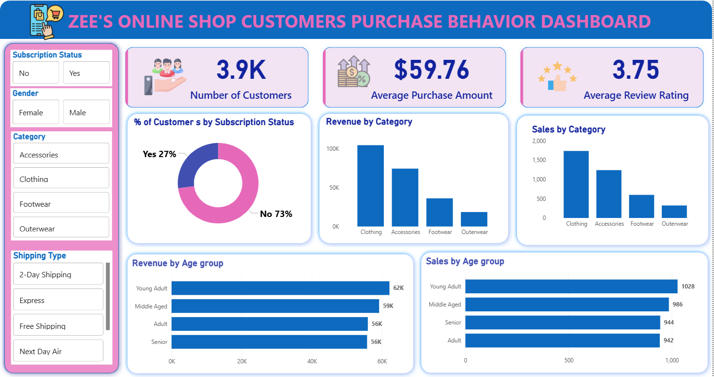
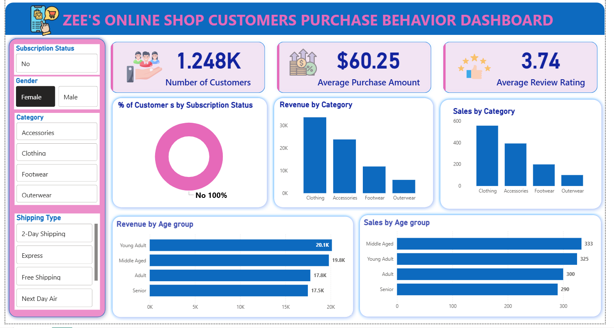
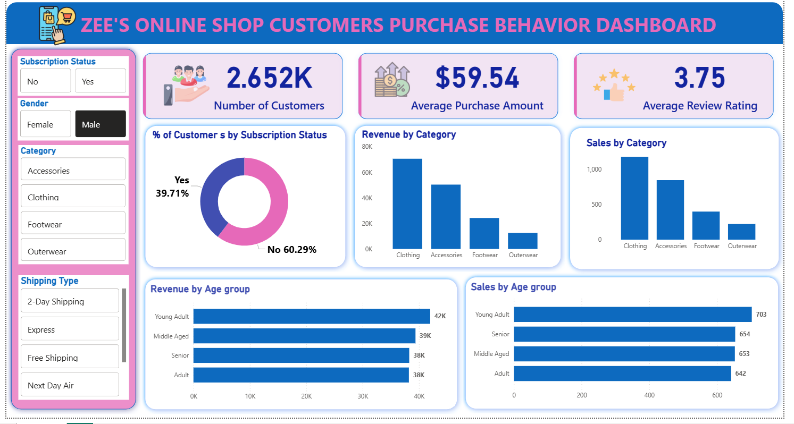
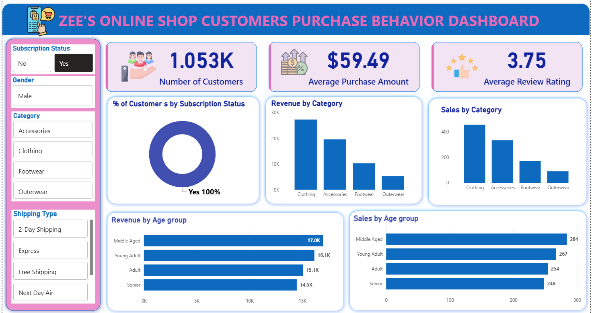
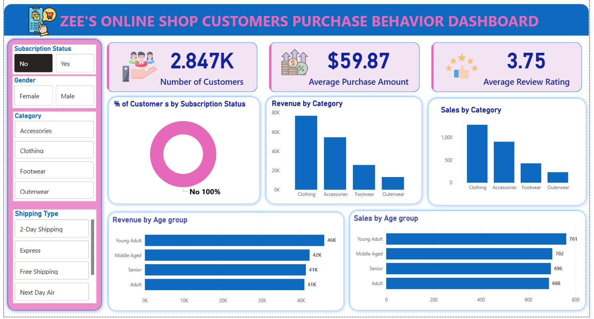
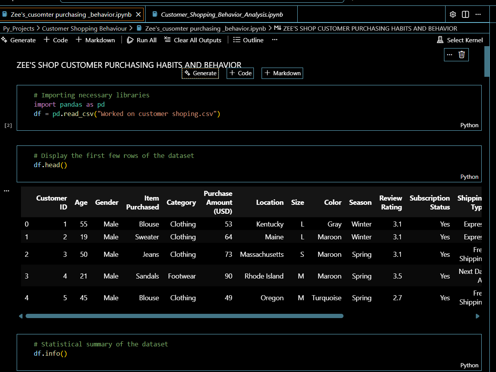

# ZEE’S SHOP CUSTOMERS PURCHASING HABITS AND BEHAVIOUR
Analysis of Customers Purchase Behaviour from Zee's Mart Dataset.

 
## Introduction

This project analyzes transactional data from **ZEE’s Shop** to uncover customers purchasing habits and behaviors.
Aim to uncover actionable insights that could optimize sales strategies, improve marketing campaigns and enhance customer retention efforts.

By understanding patterns such as;
- purchase frequency
- Average order value
- product preferences

## Goal of Analysis

1.	To analyze overall customer and product dataset and identify high-performing products and customer segments.
2.	To derive data backed insights that could help stakeholders to improve customer experience, sales strategies, Project strategies and marketing efforts.
 
 
## Problem Statement 🤔

The stakeholders of ZEE’s shop wanted to move away from "mass marketing" and towards "targeted marketing."  They want to better understand its customers’ shopping
behavior in order to improve sales, customer satisfaction, and long-term loyalty. The management team has also noticed changes in purchasing patterns across demographics,
product categories, and sales channels (online vs. offline). They are particularly interested in uncovering which factors, such as discounts, reviews, seasons, or payment preferences,
drive consumer decisions and repeat purchases. 

**_The Challenge_**:🤔 The marketing team struggled to distinguish between high-value loyalists and one-time shoppers. They needed a data-driven approach to segment their audience and optimize ad spend. 
“How can the company leverage consumer shopping data to identify trends, improve customer engagement, and optimize marketing and product strategies?”

📂 **Dataset Description**
The dataset used in this analysis contains transactional data from an online retail store. It includes customer information, product details, and purchase history. 
Rows: 3,900, Columns: 18  (Available upon request)

**Key Features:**
- Customer demographics (Age, Gender, Location, Subscription Status)
- Purchase details (Item Purchased, Category, Purchase Amount, Season, Size, Color)
- Shopping behavior (Discount Applied, Promo Code Used, Previous Purchases, Frequency of Purchases, Review Rating, Shipping Type)
- Missing Data: 37 values in Review Rating column

##  ⚙️ Tools/ Skill and Methodologies demonstrated 

The following tools and technologies were used to perform this analysis:
1.	**Excel**: - To preview and do basic cleaning
2.	**Python**: Data Preparation and Advance cleaning.
- Pandas: For data manipulation and cleaning. 
 -	Exploratory Data Analysis (EDA)
 -	Missing Data Handling
 -	Column Standardization
 - Data Consistency Check
 -	 Database Integration
- NumPy: For numerical operations.
- Jupyter Notebooks: Used for interactive analysis and visualizations.

3.	**SQL**:  PostgreSQL
 -	For querying data stored in relational databases.
 -	performed structured analysis in PostgreSQL to answer key business questions

4.	POWER BI 📊
-	Build interactive dashboard in Power BI to present insights visually
-	Made use of measure, slicer, Filters, 
  
 
## Visualization 📊

**GENDER BASED VISUALIZATION**

 FEMALE         |     MALE
:---------------:|:-------------------------:
        | 

 SUBSCIBERS         |     UNSUSCRIBERS
:---------------:|:-------------------------:
        | 
 
You can interact with report [here](https://surl.li/wnoalg)

  SQL iNTERFACE         |     PYTHON, JUPYTER NOTEBOOK
:---------------:|:-------------------------:
        | 

 SUBSCIBERS         |     UNSUSCRIBERS
:---------------:|:-------------------------:
        | 

## Analysis 📈📉
 
🔑 Key Findings
Here are some key insights drawn from the analysis:
1.	Purchase Frequency: Customers with high purchase frequency tend to have higher lifetime value, which suggests they may be more loyal to the brand.
2.	Product Preferences: Electronics and clothing items showed the highest sales, with electronics being particularly popular during holiday seasons.
3.	Customer Segmentation: Customers who purchased at least once a month were categorized as frequent buyers, contributing to 70% of total sales.
4.	Seasonal Trends: Sales peaked around Black Friday and other major shopping holidays, while the summer months saw a dip in purchases.
5.	Demographic Insights: Younger customers (18-35) had higher spending in electronics, while middle-aged customers (36-50) preferred clothing and home goods.

 
## Conlusion and Recommendation
 
- Illinois has the highest impact on the income althogh relatively negligible. 💵
- There are 128products in the stores with a worth of 140 million dollars. 😄 🤓
 
# Recommendation:
For a deep dive into the analysticsm, the datasets of the previous years will be required for comparison and data driven decision making. 🙏

